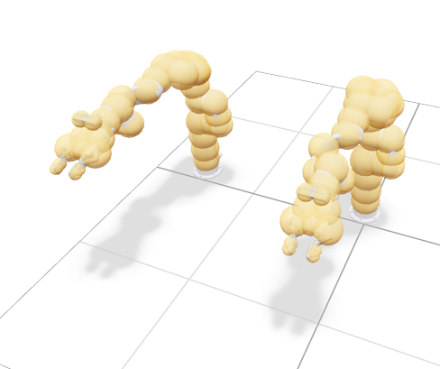
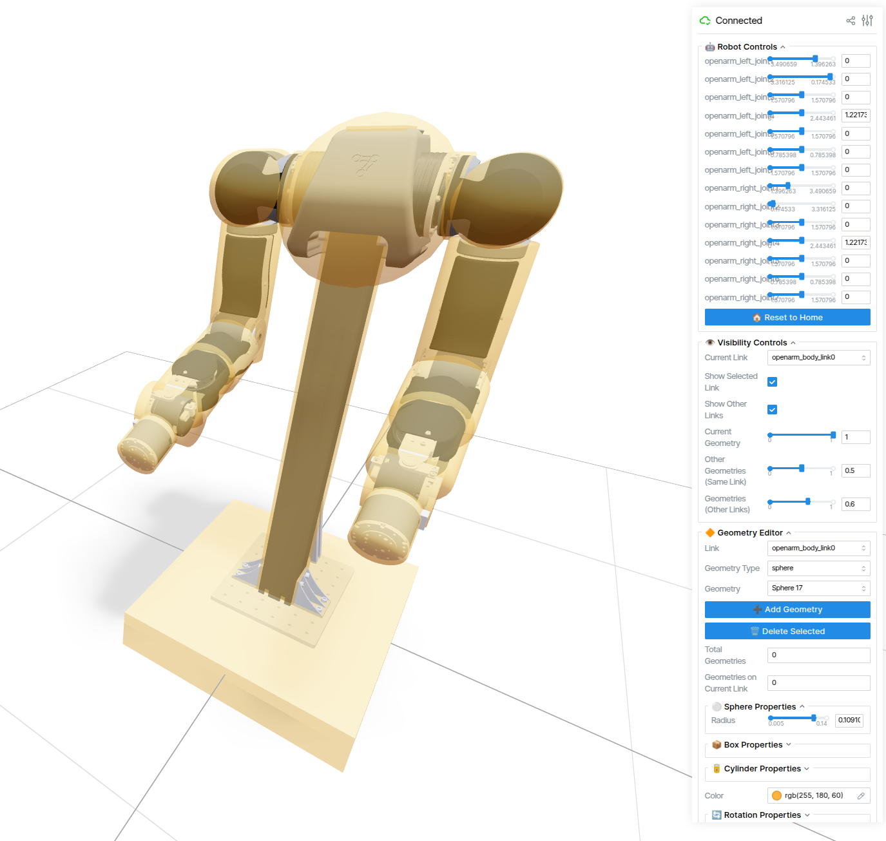

# Bubblify: Interactive URDF Collision Simplification Tool

<p align="center">
  
  
</p>


## Overview

Bubblify is an interactive tool for creating geometric approximations of robot geometries directly from Universal Robot Description Format (URDF) specifications. It provides an intuitive 3D interface for placing collision geometries (spheres, boxes, and cylinders) on robot links, enabling efficient collision checking for motion planning applications.

Geometric approximations can significantly reduce the computational load of collision detection, have better support across simulators, and maintain accurate approximations of the source robot model while fixing mesh defects.

## Installation
<p align="left">
<a href="https://pypi.org/project/viser/">
    
</a>
</p>

Install Bubblify directly from PyPI:

```bash
pip install bubblify
```

## Usage

### Basic Usage

Launch Bubblify with a URDF file:

```bash
bubblify --urdf_path path/to/your/robot.urdf
```

### Command Line Options

- `--urdf_path` (required): Path to the URDF file to spherize
- `--geometry_config` (optional): Load an existing geometry configuration
- `--port` (optional): Port for the web interface (default: 8080)
- `--show_collision` (optional): Display collision meshes (default: False)

### Example Commands

```bash
# Basic usage
bubblify --urdf_path ./assets/xarm6/xarm6_rs.urdf

# Load with existing geometry configuration
bubblify --urdf_path ./assets/xarm6/xarm6_rs.urdf --geometry_config ./config/xarm6_spheres.yml

# Custom port and show collision meshes
bubblify --urdf_path ./robot.urdf --port 8081 --show_collision
```

## Interactive Features

### Demo Video
<video src="https://github.com/user-attachments/assets/003f248c-a185-4bb0-ae1b-964adfe20ee0" width="320" height="480"></video>

## Supported Geometry Types

Bubblify supports multiple geometry types for precise robot collision approximation:

### 1. Spheres
- **Parameters**: Radius
- **Use Cases**: Joints, circular components
- **URDF Representation**: `<sphere radius="0.05"/>`

### 2. Boxes
- **Parameters**: Length, width, height
- **Use Cases**: Rectangular components, links
- **URDF Representation**: `<box size="0.1 0.1 0.1"/>`

### 3. Cylinders
- **Parameters**: Radius, height
- **Use Cases**: Circular links, shafts
- **URDF Representation**: `<cylinder radius="0.05" length="0.1"/>`

## Interactive Geometry Editing

### Geometry Selection
1. Choose geometry type from the "🔶 Geometry Editor" panel
2. Select from the "Geometry Type" dropdown: sphere, box, or cylinder

### Parameter Adjustment
Based on the selected geometry type, corresponding parameter panels are displayed:

- **⚪ Sphere Properties**: Adjust sphere radius
- **📦 Box Properties**: Adjust box length, width, height
- **🥫 Cylinder Properties**: Adjust cylinder radius and height

### Interactive Resize Gizmos 🆕

#### Box Resize Gizmos
Box geometries provide intuitive 3D size adjustment:

- **6 Resize Axes**: Each box has resize axes in ±X, ±Y, ±Z directions
- **Surface Positioning**: Resize axes are positioned on box surfaces for easy identification
- **Color Coding**: 
  - 🔴 Red: X-axis direction (length)
  - 🟢 Green: Y-axis direction (width)  
  - 🔵 Blue: Z-axis direction (height)
- **Real-time Updates**: Dragging resize axes updates box size and UI sliders simultaneously
- **Minimum Size Limits**: Prevents box dimensions smaller than 1cm for effective collision detection
- **Smart Synchronization**: When adjusting one axis, other axes automatically reposition to stay on box surfaces

### Rotation Features 🆕

#### 3D Rotation Control
- **3D Transform Controllers**: Drag rotation rings in 3D view to rotate geometries (boxes and cylinders only)
- **RPY Sliders**: Precisely set Roll, Pitch, Yaw angles in GUI panel (-π to π radians)
- **Real-time Synchronization**: 3D controllers and RPY sliders synchronize to show current rotation state
- **Sphere Optimization**: Sphere rotation is disabled as spheres are completely center-symmetric

#### Rotation Representation
- **RPY Angles**: Roll-Pitch-Yaw Euler angles (radians)
- **Quaternions**: Internal quaternion representation for precise rotation calculations
- **Automatic Conversion**: Automatic conversion between RPY and quaternions for accuracy

## Benefits for Motion Planning

Geometric approximations offer several key advantages for robotics applications:

### Computational Efficiency
- **Fast Collision Detection**: Primitive-primitive collision checks (sphere-sphere, box-box, cylinder-cylinder) are computationally simple
- **Reduced Query Time**: Orders of magnitude faster than mesh-based collision detection
- **Real-time Planning**: Enables real-time motion planning for complex robots

### Robustness
- **Numerical Stability**: Primitive shapes eliminate mesh artifacts and numerical precision issues
- **Consistent Geometry**: Uniform collision representation across different simulators
- **Simplified Physics**: More stable physics simulation with primitive shapes

### Motion Planning Integration
- **Sampling-based Planners**: Faster collision checking enables more thorough space exploration
- **Optimization-based Methods**: Smooth distance gradients improve trajectory optimization
- **Multi-robot Systems**: Efficient collision checking scales better with robot count

### Compatible Motion Planning Libraries
Bubblify's spherized URDFs and YAMLs work with modern motion planning frameworks:
- **[cuRobo](https://curobo.org/)**: NVIDIA's CUDA-accelerated motion planning library
- **[VAMP](https://github.com/KavrakiLab/vamp)**: Vectorized Approximate Motion Planning

## File Formats

### Input
- **URDF Files**: Standard Robot Description Format with visual and collision meshes

### Output
- **Geometric URDF**: New URDF file with collision geometries replaced by primitive shapes (spheres, boxes, cylinders)
- **Configuration YAML**: Geometry parameters for reproducible results

### Example Configuration
```yaml
collision_geometries:
  base_link:
    - center: [0.0, 0.0, 0.0]
      type: sphere
      radius: 0.05
      # Note: Spheres don't include rotation info (center-symmetric)
    - center: [0.1, 0.0, 0.0]
      type: box
      size: [0.1, 0.1, 0.1]
      rpy: [0.785, 0.0, 0.0]  # 45° rotation around X-axis
    - center: [0.2, 0.0, 0.0]
      type: cylinder
      radius: 0.03
      height: 0.15
      rpy: [0.0, 0.0, 1.047]  # 60° rotation around Z-axis
  link1:
    - center: [0.0, 0.0, 0.15]
      type: sphere
      radius: 0.06
```

### URDF Export Example
The exported URDF file generates corresponding collision elements for each geometry type, including rotation information:
```xml
<collision name="sphere_0">
  <origin xyz="0.0 0.0 0.0" rpy="0.0 0.0 0.0"/>
  <geometry>
    <sphere radius="0.05"/>
  </geometry>
</collision>
<collision name="box_1">
  <origin xyz="0.1 0.0 0.0" rpy="0.785 0.0 0.0"/>  <!-- 45° rotation around X-axis -->
  <geometry>
    <box size="0.1 0.1 0.1"/>
  </geometry>
</collision>
<collision name="cylinder_2">
  <origin xyz="0.2 0.0 0.0" rpy="0.0 0.0 1.047"/>  <!-- 60° rotation around Z-axis -->
  <geometry>
    <cylinder radius="0.03" length="0.15"/>
  </geometry>
</collision>
```

## Technical Details

### Effective Radius Calculation
- **Spheres**: Direct use of radius value
- **Boxes**: Use half of diagonal length as effective radius
- **Cylinders**: Use cylinder radius as effective radius

### Data Structure
The new `Geometry` class contains parameters for all geometry types, with the `geometry_type` field determining which parameters to use.

This design ensures code simplicity and extensibility while maintaining complete compatibility with existing code.

## Contributing

Contributions are welcome! Please feel free to submit issues, feature requests, or pull requests.
